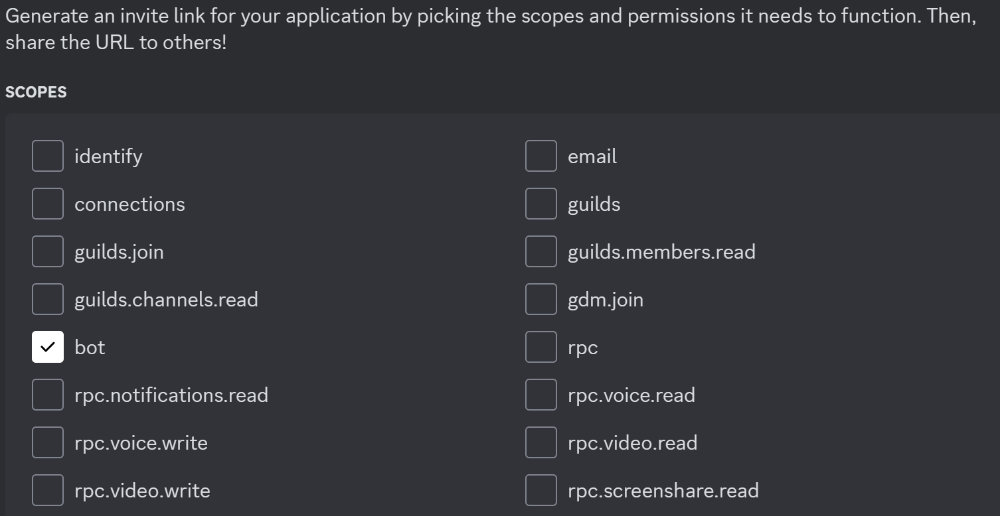
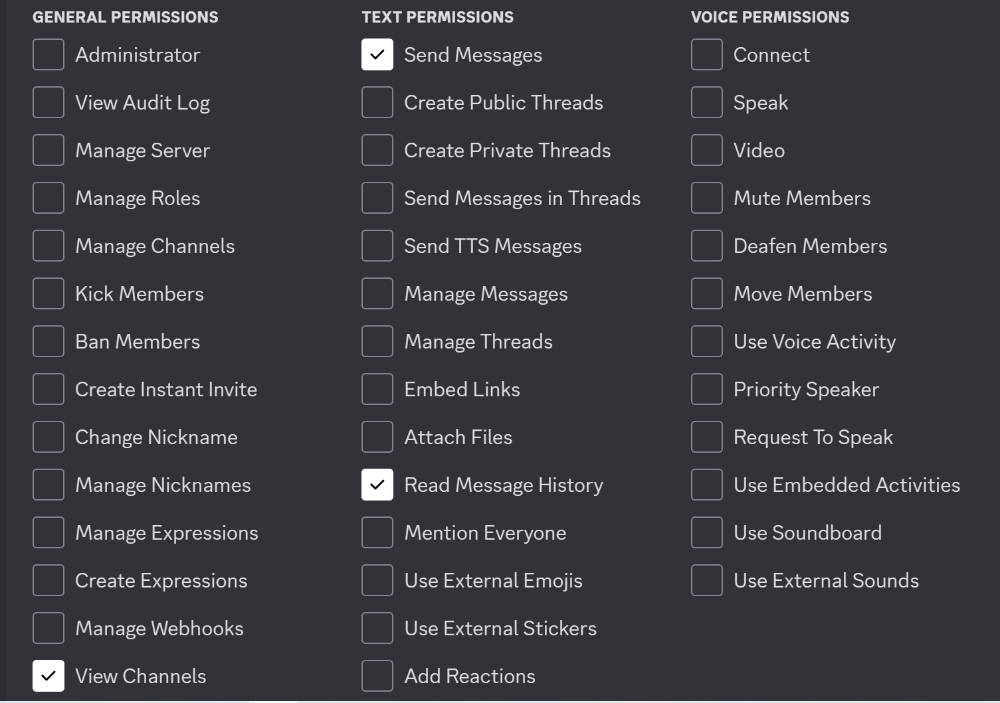

# Usage instructions

## Create the discord bot
1. Click [on the discord developers page here](https://discord.com/developers) and follow the Build-A-Bot flow. You can use whatever name and images you want
2. Go to the OAuth tab. Copy the **Client ID** and the **Client Secret**. You will need these for later use. 
3. Scroll down and make sure the following **Scopes** and **Permissions** are checked. 
* Scopes 
    - Bot Scope
    

* Permissions
    - Send Messages
    - Read Message History
    - View Channels

3. Go to the Bot tab and turn on **Message Content Intent**

4. Make sure you save your changes

## Bot Environment Variables
1. Run `git clone https://github.com/Fluffy9/LurkerLLama` to get the source code
2. Rename example.env to .env and edit it to contain your your own keys
```
# The Client Secret found in step 2
DISCORD_API_TOKEN=
# The Client Id found in step 2
DISCORD_CLIENT_ID=
# https://support-dev.discord.com/hc/en-us/articles/360028717192-Where-can-I-find-my-Application-Team-Server-ID#:~:text=Right%2Dclick%20the%20server%20icon,seeing%20a%20Copy%20ID%20option.
DISCORD_GUILD_ID=
# If your Qdrant database requires an API key, enter it here. If you are using docker-compose as set up here, you do not need one
QDRANT_KEY=
# If you are using docker-compose, this will be the URL for your qdrant database, otherwise use the url provided by your hosted qdrant instance
QDRANT_URL=http://qdrant:6333
# Your Akash Chat API key which you can generate here: https://chatapi.akash.network/
AKASH_CHAT_API_KEY=
AKASH_CHAT_API_ENDPOINT=https://chatapi.akash.network/api/v1
AKASH_CHAT_API_MODEL=Meta-Llama-3-1-8B-Instruct-FP8
# Akash chat does not currently provide any models to generate embedding. Therefore we need to add an OpenAI API key here
OPENAI_API_KEY=
```

3. Rename the Dockerfile.example to Dockerfile and insert your OpenAI API Key in the environment variable 

```
FROM tyrrrz/discordchatexporter:stable
RUN apk update && \
    apk upgrade && \
    apk add --update npm && \
    apk add --update nodejs 
WORKDIR /app
COPY package*.json ./
RUN npm install
COPY . .
#Akash chat does not currently provide any models to generate embedding. Therefore we need to add an OpenAI API key here
ENV OPENAI_API_KEY=[Your API key]
EXPOSE 8080
ENTRYPOINT npm run dev
```

## Build and run the bot
**Note: You need Docker and Docker-compose installed**
1. In the root folder which contains the docker-compose file, run `docker-compose build` to build the necessary docker images

2. Run `docker-compose up` to start the application

## Deploy the bot to Akash Network
