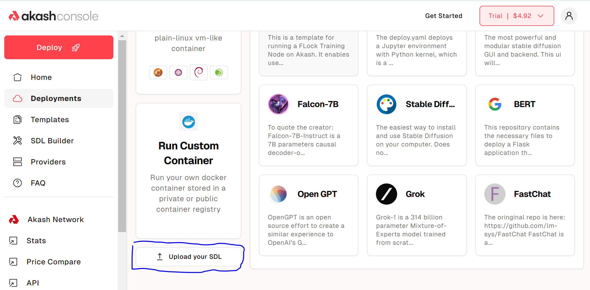

# Testing
If you'd like to play with the bot, it is actively running in the [LLamaGarden Discord server](https://discord.gg/cs7VPXgu) where I am currently training it to answer questions about it's own installation process. If you have any questions about how it works, you can see if it has any insight before you ask me

It is also currently in use in the RaidGuild Discord server.

The deployment is hosted on Akash network here (Although there is no website included with this deployment): ugoa004ln193j4ino0gt7klr3s.ingress.europlots.com

# Why???
One of the many problems discovered when working with [clients inside discord channels](https://github.com/raid-guild/RIPs/issues/189) in RaidGuild. Discord has a channel limit and it's easy to hit that when every client project gets a new channel. No one wants to delete the channel outright and lose valuable insights. 

Having an internal website for that info isn't always that useful when no one is regularly backing up data. It can also be frustrating to sift through irrelevant chat logs and memes. Having a Discord bot that can archive and answer questions about the channels is a useful tool in this situation since all the archiving and querying happens from within Discord itself.

I am sure there are other companies that are heavy Discord users who are having similar issues
## Additional features coming soon
- Citations with links to source material referenced by the AI
- More 'Customer Support' features like automatically replying to user questions

# How it works
There are 3 commands exposed. 
- `/lurk` teaches the llama about your channel
- `/llama` asks the llama a question
- `/status` prints the log file

## Lurk
To teach the llama about your channel, you need to run the `/lurk` command. This command initiates a 3 step process:
1. Back up the entire discord channel using [this CLI tool](https://github.com/Tyrrrz/DiscordChatExporter).
2. Parse the JSON result into a SQLite database to avoid indexing extraneous or duplicate messages
3. Use LlamaIndex to build embeddings and store them in the Qdrant vector store. This currently is using OpenAI's embedding model, but will use AkashChat when an embedding model is available

This can be a long running process depending on how many messages there are. `/lurk` cannot be used if the previous process is still in progress, and it cannot be canceled (at this time). You can use `/status` to check the progress of this process

## LLama
To ask the llama a question about the things it has lurked, you should use the `/llama` command. 
This command takes a question from the user and uses Qdrant to gather important context. This data is fed to the AkashChat LLM to reply with an informed response.

## Status
This command simply prints the logs
# How to build your own
The bot doesn't have any isolation, so if you want to have one for your own discord channel, it would be wise to deploy your own. It is easy and cheap to deploy (currently running on Akash Network for under 10 dollars a month). The only thing you need to do is gather the relevant environment variables from creating a Discord bot, AkashChat, and OpenAI (temporarily) 

## Create the discord bot
1. Click [on the discord developers page here](https://discord.com/developers) and follow the Build-A-Bot flow. You can use whatever name and images you want
2. Go to the OAuth tab. Copy the **Client ID** and the **Client Secret**. You will need these for later use. 
3. Scroll down and make sure the following **Scopes** and **Permissions** are checked. 
* Scopes 
    - Bot Scope
    

* Permissions
    - Send Messages
    - Read Message History
    - View Channels

3. Go to the Bot tab and turn on **Message Content Intent**

4. Make sure you save your changes

## Bot Environment Variables
The following environment variables will need to be set:

*The Client Secret found in step 2 of creating the Discord Bot*
**DISCORD_API_TOKEN** = [Your_token_goes_here]

*The Client Id found in step 2 of creating the Discord Bot*
**DISCORD_CLIENT_ID**=[Your_client_id_goes_here]

*[See discord support for instructions on how to get the guild/server ID](https://support-dev.discord.com/hc/en-us/articles/360028717192-Where-can-I-find-my-Application-Team-Server-ID#:~:text=Right%2Dclick%20the%20server%20icon,seeing%20a%20Copy%20ID%20option)*
**DISCORD_GUILD_ID**=[Your_guild_id_goes_here]

*If your Qdrant database requires an API key, enter it here. If you are using docker-compose as set up here, you do not need one*
**QDRANT_KEY**=

*This is the URL for your qdrant database. If you are self-hosting qdrant as described keep this setting shown below. If you are using a cloud-hosted service use the url provided by your hosted qdrant instance*
**QDRANT_URL**=http://qdrant:6333

*Your Akash Chat API key which you can generate [here](https://chatapi.akash.network/)*
**AKASH_CHAT_API_KEY**=[Your_api_key_goes_here]

*Akash chat endpoint*
**AKASH_CHAT_API_ENDPOINT**=https://chatapi.akash.network/api/v1

*The Akash Chat LLM that you want to use*  
**AKASH_CHAT_API_MODEL**=Meta-Llama-3-1-8B-Instruct-FP8

*Akash chat does not currently provide any models to generate embedding. Therefore we need to add an OpenAI API key here (You may need to pay for credits)*

**OPENAI_API_KEY**=[Your_openAI_api_key_goes_here]

## Deploying to Akash
1. Download the SDL file [from the GitHub](https://github.com/Fluffy9/LurkerLLama/blob/main/lurkerllama.sdl)
2. Go to the [Akash Console](https://console.akash.network/new-deployment) and upload the SDL file 

3. There are 9 environment variables with 3 already filled in. You need to fill in the other 6 with the info 
from [Bot Environment Variables](#bot-environment-variables) 
4. Follow the prompts to choose a provider and deploy

## Deploying Locally
**Note: You need Docker and Docker-compose installed**
1. Run `git clone https://github.com/Fluffy9/LurkerLLama/`
2. Rename docker-compose.example.yaml to docker-compose.yaml
3. Edit the docker-compose.yaml.There are 9 environment variables with 3 already filled in. You need to fill in the other 6 with the info 
from [Bot Environment Variables](#bot-environment-variables) 

4. In the root folder which contains the docker-compose file, run `docker-compose up` to start the application

